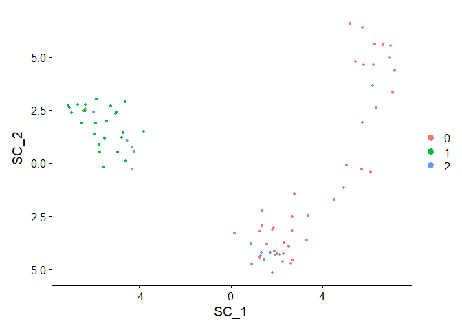
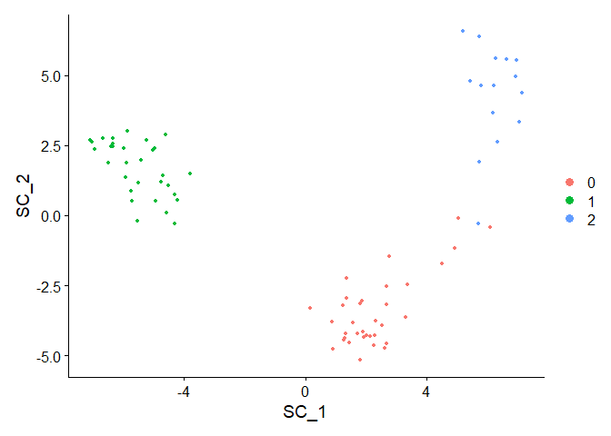
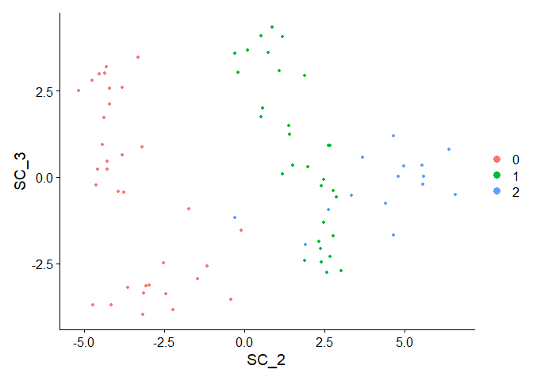
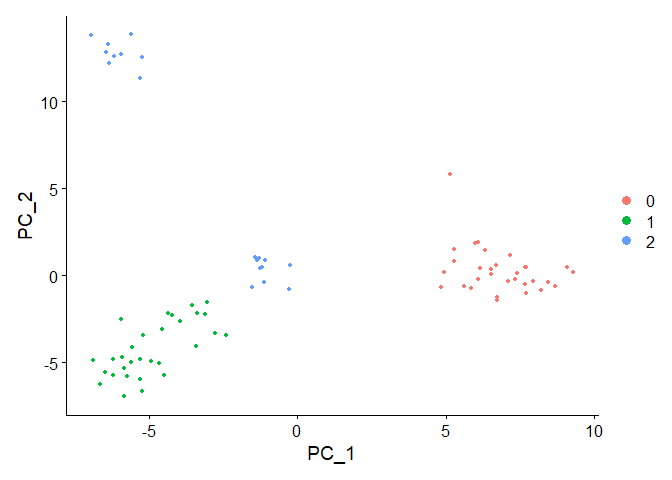
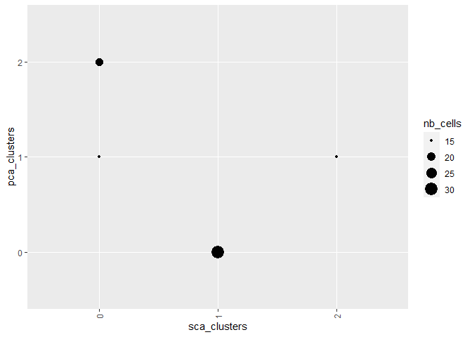

# Installation

Install from Github.

## Note on version

If you have an older version of scipy (fails in 1.5, works in 1.7), you
will encounter this error:

    Error in py_call_impl(callable, dots$args, dots$keywords) : 
      TypeError: rankdata() got an unexpected keyword argument 'axis'

That is the case if you have an older version of Python (fails with 3.6,
works with 3.8). See `reticulate`’s documentation for details on how to
solve it, the following should work:

``` r
reticulate::install_python(version = "3.9.6")
reticulate::use_python_version("3.9.6", required = TRUE)
reticulate::virtualenv_create(envname = "shannonca", packages = "shannonca", version = "3.9.6")
```

In that case, you can then load your installed environment before
calling `RunSCA()` with:

``` r
reticulate::use_virtualenv("shannonca")
```

# Usage

Interacts directly with a Seurat object, adding an object in the
`reductions` slot (just like `RunPCA()` or `RunUMAP()`).

``` r
library(Seurat)
#> Attaching SeuratObject
library(rshannonca)


reticulate::use_virtualenv("shannonca") #or adapt to your local Python environment

data("pbmc_small")
pbmc_small <- NormalizeData(pbmc_small)
pbmc_small <- FindVariableFeatures(pbmc_small)
pbmc_small <- ScaleData(pbmc_small)
#> Centering and scaling data matrix
```

Now perform the SCA

``` r
pbmc_small <- RunSCA(pbmc_small)
#> Warning in normalizePath(path.expand(path), winslash, mustWork): path[1]="C:
#> \Users\Alexis Weinreb\Anaconda3\envs\matplotlib/python.exe": The system cannot
#> find the file specified
#> Warning in normalizePath(path.expand(path), winslash, mustWork): path[1]="C:
#> \Users\Alexis Weinreb\.conda\envs\voila2env/python.exe": The system cannot find
#> the file specified
#> Warning in normalizePath(path.expand(path), winslash, mustWork): path[1]="C:
#> \Users\Alexis Weinreb\Anaconda3\envs\matplotlib/python.exe": The system cannot
#> find the file specified

DimPlot(pbmc_small, reduction = "sca")
```



We can directly cluster on the results of the SCA:

``` r
pbmc_small <- FindNeighbors(pbmc_small, reduction = "sca")
#> Computing nearest neighbor graph
#> Computing SNN
pbmc_small <- FindClusters(pbmc_small)
#> Modularity Optimizer version 1.3.0 by Ludo Waltman and Nees Jan van Eck
#> 
#> Number of nodes: 80
#> Number of edges: 1454
#> 
#> Running Louvain algorithm...
#> Maximum modularity in 10 random starts: 0.5862
#> Number of communities: 3
#> Elapsed time: 0 seconds
```

Note that we decomposed the SCA by default into 50 dimensions (or the
number of genes if it is smaller), we can visualize more than 2.

``` r
DimPlot(pbmc_small, dims = 1:2, reduction = "sca")
```



``` r
DimPlot(pbmc_small, dims = c(2,3), reduction = "sca")
```



``` r
# in 3D, cannot be displayed on Github
plot.data <- FetchData(object = pbmc_small,
                       vars = "seurat_clusters") |>
  cbind(Embeddings(object = pbmc_small,
                   reduction = "sca"))

plotly::plot_ly(data = plot.data, 
                x = ~SC_1, y = ~SC_2, z = ~SC_3, 
                color = ~seurat_clusters,
                type = "scatter3d", 
                mode = "markers", 
                marker = list(size = 5, width=2), # controls size of points
                text=~seurat_clusters, #This is that extra column we made earlier for which we will use for cell ID
                hoverinfo="text") #When you visualize your plotly object, hovering your mouse pointer over a point shows cell names


rm(plot.data)
```

And we can compare clustering based on SCA and the standard one based on
PCA:

``` r
# save SCA clusters
pbmc_small$sca_clusters <- pbmc_small$seurat_clusters

# compute PCA clusters
pbmc_small <- RunPCA(pbmc_small, verbose = FALSE)
#> Warning in irlba(A = t(x = object), nv = npcs, ...): You're computing too large
#> a percentage of total singular values, use a standard svd instead.
pbmc_small <- FindNeighbors(pbmc_small, reduction = "pca", verbose = FALSE)
pbmc_small <- FindClusters(pbmc_small, verbose = FALSE)
DimPlot(pbmc_small, reduction = "pca")
```



``` r
pbmc_small$pca_clusters <- pbmc_small$seurat_clusters


# Compare
library(ggplot2)
library(dplyr)
#> 
#> Attaching package: 'dplyr'
#> The following objects are masked from 'package:stats':
#> 
#>     filter, lag
#> The following objects are masked from 'package:base':
#> 
#>     intersect, setdiff, setequal, union

pbmc_small@meta.data |>
  group_by(sca_clusters, pca_clusters) |>
  summarize(nb_cells = n(), .groups = "drop") |>
  ggplot() +
  geom_point(aes(x = sca_clusters, y = pca_clusters, size = nb_cells)) +
  scale_x_discrete(guide = guide_axis(angle = 90))
```


